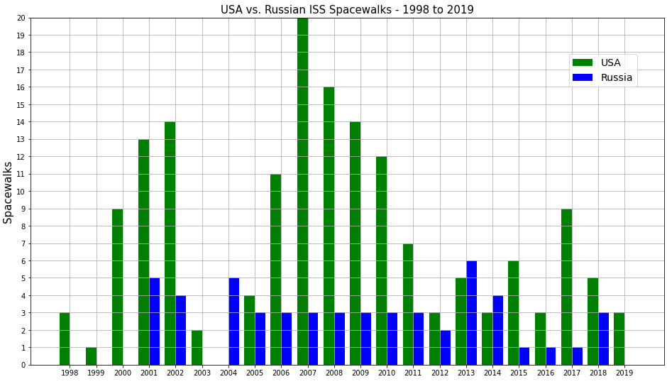

# ISS-Spacewalks
​                                                                                                                                                                                         

​                                                                                                                                                                                                                                                                                     USA vs. Russian Spacewalks from 1998 to 2019

This dataset plots the number of ISS spacewalks by the USA and Russia from 1998 to 2019. The data shows the USA had a significant lead in ISS spacewalks during the time period. 

There were four years in which Russia recorded no ISS space walks (1998,1999, 2000, and 2003), versus only one year in which the USA recorded none (2004).

On average, the number of USA ISS spacewalks was at least double those performed by the Russians.

The data was sourced by NASA and downloaded from 'data.world'.

